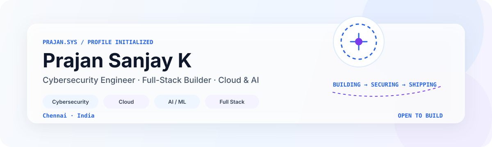

  

  
  

## Profile

I am **Prajan Sanjay K**, a **B.E. Computer Science and Engineering student specializing in Cybersecurity** at Chennai Institute of Technology. I build systems at the intersection of **security, artificial intelligence, cloud infrastructure and software engineering**.

My approach is straightforward: understand the problem, design the system, build the prototype, validate the result and engineer it toward production quality.

**Core interests**

- **Cybersecurity** — secure application design, web and network security, CTFs
- **Artificial Intelligence** — predictive systems, explainable ML and intelligent agents
- **Cloud Engineering** — AWS infrastructure, deployment, networking and operations
- **Software Engineering** — full-stack, cross-platform and real-time applications
- **Systems Research** — digital twins, predictive maintenance and applied engineering

---

## Selected Work

### SubAero — Aerothon 2026
**Aerospace Prognostics & Digital Twin Platform**

Developed with **Null Pointerz** for Aerothon 2026. SubAero focuses on predictive maintenance for aerospace engines, combining remaining-useful-life estimation, feature engineering, interpretable machine learning and physics-informed reasoning.

`Python` `Machine Learning` `XAI` `Digital Twin` `Aerospace`

### MediQue
**Real-Time Healthcare Queue Intelligence**

A clinic workflow platform designed around real-time synchronization, intelligent wait-time estimation and operational efficiency. The system connects reception, patients and clinical workflows through a unified application.

`Flutter` `Firebase` `Firestore` `Real-Time Systems`

### AURYN
**Intelligent Hospitality Operations Platform**

A multi-workspace platform connecting customer, staff and management workflows. The system combines digital hospitality experiences with AI-assisted operations and real-time restaurant management.

`Flutter` `Supabase` `AI` `SaaS`

### FINOAISPARK
**Financial Security Intelligence**

An experimental security platform exploring AI-assisted risk monitoring, banking defense workflows and multi-agent reasoning for financial systems.

`Python` `AI Agents` `Security` `FinTech`

---

## Professional Experience

### SBV Technologies Pvt. Ltd.
**DevOps & AWS Cloud Engineering Intern | May 2026 – June 2026**

Completed an 8-week engineering internship focused on cloud infrastructure, application deployment and operational management.

**Engineering exposure**

`EC2` `S3` `IAM` `VPC` `RDS MySQL` `Route 53` `ALB` `ASG` `CloudWatch` `Linux`

Worked across infrastructure design, cloud networking, application hosting, database deployment, load balancing, auto scaling, monitoring and security configuration. The experience provided practical exposure to designing and operating AWS-based application environments.

### NeuralTransformers.AI
**AI & Web Applications Intern**

Worked with AI-assisted application development and modern web technologies, building practical experience across intelligent applications, software development and integration workflows.

`AI` `Python` `Web Development` `Application Engineering`

---

## Recognition

| Result | Recognition |
|---|---|
| **3rd Place** | SRM Technowiz Web Application Competition |
| **National Finalist** | Rotary International Hackathon |
| **7th Place** | National-Level CTF Team Competition |
| **Aerothon 2026** | Aerospace systems development — Null Pointerz |

---

## Technical Profile

<table>
<tr>
<td width="50%" valign="top">

### Security

`Cybersecurity` `Web Security` `Network Security` `IAM` `CTF`

### AI / ML

`Python` `Predictive Analytics` `XAI` `Feature Engineering` `AI Agents`

### Cloud & DevOps

`AWS` `EC2` `S3` `VPC` `RDS` `ALB` `ASG` `CloudWatch` `Docker` `Linux`

</td>
<td width="50%" valign="top">

### Application Engineering

`React` `Node.js` `Express` `Flutter` `Firebase` `Supabase`

### Data

`MySQL` `MongoDB` `Firestore` `RDS`

### Engineering Practice

`Git` `GitHub` `REST APIs` `CI/CD` `Cloud Deployment` `System Architecture`

</td>
</tr>
</table>

---

## Engineering Philosophy

> **Build systems that are useful. Make them explainable. Secure them by design. Engineer them to last.**

I am particularly interested in projects where software engineering meets a real technical constraint — whether that is security, scale, reliability, prediction or operational complexity.

---

## Current Direction

**Security Engineering**  ·  **Explainable AI**  ·  **Cloud Architecture**  ·  **Aerospace Prognostics**  ·  **Intelligent Product Systems**

The current focus is on turning research-oriented ideas and hackathon prototypes into **measurable, explainable and production-minded systems**.

---

## Let's Build

I am interested in collaborating on **cybersecurity, AI/ML, cloud infrastructure, research, developer tools and ambitious product engineering projects**.

  <strong>Security-minded engineering. Intelligent systems. Real-world impact.</strong>

  Prajan Sanjay K · Chennai, India

