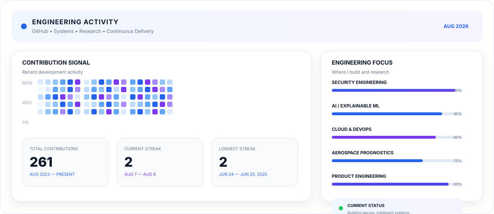

<div align="center">
  
</div>

<p align="center">
  <a href="https://github.com/prajansanjayk1"></a>
  
  
</p>

## About Me

I'm **Prajan Sanjay K**, a **B.E. CSE student specializing in Cybersecurity** with a strong interest in building secure, intelligent and production-oriented systems.

My work sits at the intersection of **Cybersecurity × AI/ML × Cloud Engineering × Full-Stack Development**. I enjoy taking an idea from architecture and implementation through deployment, testing and real-world evaluation.

- **Cybersecurity** — secure software, application security & CTFs
- **AI / ML** — predictive systems, explainable models & intelligent agents
- **Cloud Engineering** — AWS infrastructure, deployment & DevOps
- **Software Engineering** — full-stack and cross-platform application development
- **Product Engineering** — hackathons, research-driven prototypes & practical systems

---

## Technology DNA

<p align="center">
  
</p>

| Domain | Technologies & Focus |
|---|---|
| **Cybersecurity** | Security Engineering · CTF · Secure Web Development · IAM · Network Security |
| **Cloud / DevOps** | AWS EC2 · S3 · IAM · VPC · RDS · Route 53 · ALB · ASG · CloudWatch |
| **AI / ML** | Python · Predictive Analytics · Explainable ML · Feature Engineering · AI Agents |
| **Development** | React · Node.js · Express · Flutter · Firebase · Supabase |
| **Databases** | MySQL · MongoDB · Firestore · RDS |
| **Engineering** | Git · GitHub · Linux · Docker · CI/CD · Cloud Deployment |

---

## Featured Systems

<table>
<tr>
<td width="50%" valign="top">

### SubAero — Aerothon 2026
**Digital Twin & Aerospace Prognostics**

Aerospace-focused predictive maintenance platform developed for **Aerothon 2026** with team **Null Pointerz**. The project explores remaining-useful-life estimation, feature engineering, interpretable machine learning and physics-informed aerospace reasoning for turbojet engine maintenance.

`Python` `ML` `XAI` `Digital Twin` `Aerospace`

</td>
<td width="50%" valign="top">

### MediQue
**Smart Healthcare Queue Intelligence**

Real-time clinic workflow platform with live queue synchronization, intelligent wait-time estimation, receptionist workflows and patient-facing updates.

`Flutter` `Firebase` `Firestore` `AI`

</td>
</tr>
<tr>
<td width="50%" valign="top">

### AURYN
**AI-Powered Hospitality Platform**

A multi-workspace restaurant platform connecting customer, staff and manager workflows with intelligent assistance, real-time operations and a unified digital experience.

`Flutter` `Supabase` `AI` `SaaS`

</td>
<td width="50%" valign="top">

### FINOAISPARK
**Financial Security Intelligence**

An AI-assisted financial security concept exploring risk monitoring, banking defense workflows and multi-agent reasoning for financial systems.

`AI Agents` `Security` `FinTech`

</td>
</tr>
</table>

---

## Internship Experience

### DevOps & AWS Cloud Engineering Intern
**SBV Technologies Pvt. Ltd. · May 2026 – June 2026**

An 8-week internship focused on practical **AWS cloud engineering, infrastructure design, application deployment and operational management**.

**Hands-on exposure:**

`EC2` `S3` `IAM` `VPC` `RDS MySQL` `Route 53` `ALB` `ASG` `CloudWatch` `Security Groups`

Worked with cloud networking, Linux-based environments, application hosting, database deployment, load balancing, auto scaling, monitoring and production-oriented AWS workflows.

### AI & Web Applications Intern
**NeuralTransformers.AI**

Gained practical exposure to **AI-assisted application development and modern web technologies**, contributing to projects that combined software development with intelligent application capabilities.

`AI` `Web Development` `Python` `Application Development`

---

## Achievements

| Achievement | Recognition |
|---|---|
| **3rd Place** | SRM Technowiz Web Application Competition |
| **Finalist** | National-Level Hackathon — Rotary International |
| **7th Place** | National-Level CTF Team Competition |
| **Aerothon 2026** | Aerospace systems development — Team Null Pointerz |

---

## Engineering Focus

```text
CYBERSECURITY
├── Secure Application Design
├── Web & Network Security
└── CTF / Security Research

ARTIFICIAL INTELLIGENCE
├── Predictive Systems
├── Explainable Machine Learning
└── Intelligent Agents

CLOUD ENGINEERING
├── AWS Infrastructure
├── Deployment & Operations
└── Scalable Cloud Architecture

PRODUCT ENGINEERING
├── Full-Stack Applications
├── Real-Time Systems
└── Hackathon → Prototype → Product
```

---

## Engineering Activity

<div align="center">
  
</div>

---

## Current Research & Build Direction

> **Secure systems. Intelligent models. Cloud-native infrastructure.**

Currently exploring the intersection of **cybersecurity, explainable AI, predictive maintenance, cloud engineering and intelligent product architecture**.

```text
01  Security Engineering       ████████████████████  ACTIVE
02  AI / Explainable ML        ███████████████████░  ACTIVE
03  Cloud & DevOps             ██████████████████░░  ACTIVE
04  Aerospace Prognostics      █████████████████░░░  RECENT
05  Product Engineering        ███████████████████░  ACTIVE
```

---

## Let's Connect

I'm open to **cybersecurity, AI/ML, cloud engineering, full-stack development, research and ambitious engineering projects**.

<p align="center">
  <b>Build with purpose. Engineer with discipline. Secure what you ship.</b>
</p>

<p align="center">
  <sub>Prajan Sanjay K · Cybersecurity × AI/ML × Cloud × Engineering</sub>
</p>
