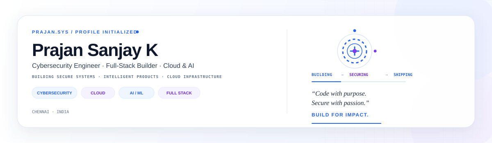

  

  

  
  
  

## About Me

I'm **Prajan Sanjay K**, a **B.E. CSE student specializing in Cybersecurity** at Chennai Institute of Technology, building systems at the intersection of **Cybersecurity, AI/ML, Cloud Engineering and Full-Stack Development**.

I enjoy taking technically demanding ideas from **problem definition → system architecture → implementation → validation → deployment**. My work spans security-focused applications, intelligent predictive systems, cloud infrastructure and real-world product engineering.

**What I work on**

- **Cybersecurity** — secure application design, web and network security, CTFs
- **AI / ML** — predictive systems, explainable machine learning and intelligent agents
- **Cloud Engineering** — AWS infrastructure, deployment, networking and operations
- **Software Engineering** — full-stack, cross-platform and real-time applications
- **Systems Research** — digital twins, predictive maintenance and applied engineering

---

## Selected Work

<table>
<tr>
<td width="50%" valign="top">

### Digital Twin For Turbojet Engine (HAL & IIT Indore)
**Aerospace Prognostics & Digital Twin — Top 8 Finalist**

Developed for HAL & IIT Indore Aerothon. A predictive maintenance platform for aerospace engines combining remaining-useful-life estimation, LSTM/CNN/Random Forest models, feature engineering, and 3D digital twin visualization.

`Python` `PyTorch` `LSTM/CNN` `Blender` `Unity` `Digital Twin` `Aerospace`

</td>
<td width="50%" valign="top">

### MediQue
**Smart Healthcare Queue Platform**

A clinic workflow platform built around live queue synchronization, AI wait-time estimation, QR check-in, and role-based workflows for patients, doctors, and admins.

`Flutter` `React.js` `Node.js` `Express.js` `Socket.io` `Firebase`

</td>
</tr>
<tr>
<td width="50%" valign="top">

### NeuralTransformer.ai
**Official Company Website & Course Platform**

Full-stack official website and online course management platform with integrated Razorpay payment gateway, deployed on AWS.

`PHP` `JavaScript` `HTML/CSS` `AWS` `Razorpay`

</td>
<td width="50%" valign="top">

### DevOps & Cloud Infrastructure (SBV Technologies)
**Cloud Engineering & CI/CD**

Designed, deployed, and managed cloud infrastructure using AWS services (EC2, S3, IAM, RDS) with automated CI/CD deployment pipelines.

`AWS EC2` `AWS S3` `AWS IAM` `AWS RDS` `CI/CD` `DevOps`

</td>
</tr>
</table>

---

## Internship Experience

### SBV Technologies Pvt. Ltd.
**DevOps & AWS Cloud Engineering Intern | May 2026 – July 2026**

Completed an 8-week engineering internship focused on **cloud infrastructure, application deployment and operational management**.

**Engineering exposure:** `EC2` `S3` `IAM` `RDS MySQL` `CI/CD` `CloudWatch` `Linux`

Worked across infrastructure design, cloud networking, application hosting, database deployment, load balancing, auto scaling, monitoring and security configuration, gaining practical experience operating AWS-based application environments.

### NeuralTransformers.AI
**Full Stack Intern | Sep 2023 – Nov 2023**

Gained practical experience in **full-stack application development and modern web technologies**, building the official company website and online course platform with Razorpay payment integration on AWS.

`PHP` `JavaScript` `HTML/CSS` `AWS` `Razorpay`

---

## Recognition

| Result | Recognition |
|---|---|
| **Top 8 Finalist** | HAL Aerothon & IIT Indore (2500+ participants) |
| **7th Place** | National-Level CTF Cybersecurity Team Competition |
| **2nd Runner Up** | SRM TechnoWiz Hackathon (SRM University) |
| **Winner** | State Level Hackathon (Chettinad Vidyashram School) |
| **Finalist** | Rotary International Hackathon |

---

## Technology Stack

  

| Domain | Focus |
|---|---|
| **Security** | Cybersecurity · Web Security · Network Security · Vulnerability Assessment · Nmap · Wireshark · CTF |
| **AI / ML** | PyTorch · LSTM · CNN · Random Forest · Predictive Analytics · Feature Engineering |
| **Cloud / DevOps** | AWS · EC2 · S3 · IAM · RDS · CI/CD Pipelines · MySQL Workbench |
| **Application Engineering** | React.js · Node.js · Express.js · Flutter · Socket.io · Firebase |
| **Languages** | Python · C++ · C · SQL · JavaScript |

---

## Engineering Philosophy

> **Build systems that are useful. Make them explainable. Secure them by design. Engineer them to last.**

---

## Interactive Web Portfolio & Terminal

- 🌐 **Web Portfolio**: [https://prajansanjayk1.github.io/prajansanjayk1/](https://prajansanjayk1.github.io/prajansanjayk1/)
- 💻 **Interactive Terminal**: [https://prajansanjayk1.github.io/prajansanjayk1/terminal](https://prajansanjayk1.github.io/prajansanjayk1/terminal)
- 🚀 **HAL Case Study**: [https://prajansanjayk1.github.io/prajansanjayk1/projects/hal-digital-twin](https://prajansanjayk1.github.io/prajansanjayk1/projects/hal-digital-twin)
